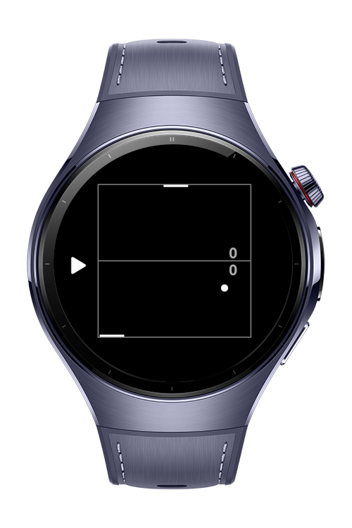
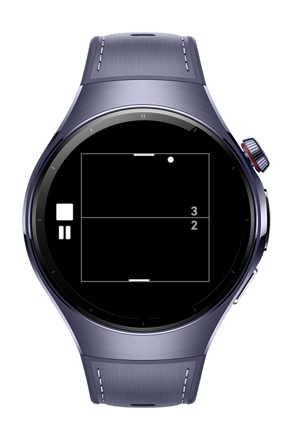
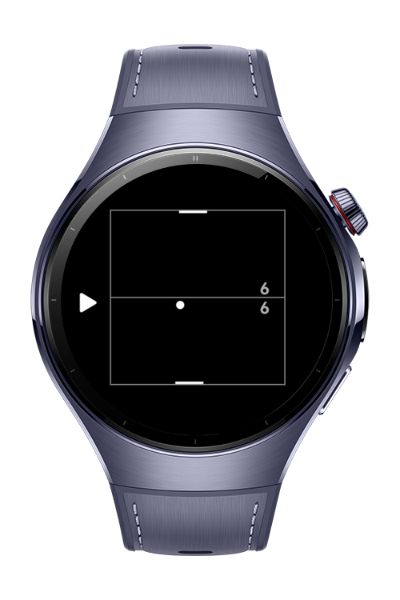

> **Note:** To access all shared projects, get information about environment setup, and view other guides, please visit [Explore-In-HMOS-Wearable Index](https://github.com/Explore-In-HMOS-Wearable/hmos-index).

# Pong Game

**Pong Game** is a 2D table-tennis-style game with simple black and white graphics.
The screen is split horizontally, with a ball bouncing between two paddles.
Bottom paddle is controlled by the **player**, the top paddle by the **computer** (AI opponent).

# Preview
<div>
  
  
  
  
</div>

# Use Cases

Simple yet entertaining little classic pong game for wearables.

# Tech Stack

- **Languages**: ArkTS, ArkUI
- **Frameworks**: HarmonyOS SDK 5.1.0
- **Tools**: DevEco Studio 5.1.0
- **Libraries**: @kit.ArkUI

# Directory Structure

```
entry/src/main/ets/
├───components
│       GameControls.ets
│       GameScores.ets
│       PongGameCanvas.ets
├───entryability
│       EntryAbility.ets
├───entrybackupability
│       EntryBackupAbility.ets
├───lib
│       GameController.ets
│       GameRenderer.ets
├───pages
│       Index.ets
├───utils
│       constants.ets
└─── 
```

# Constraints and Restrictions
## Supported Device
- Huawei Watch 5

# LICENSE
**Pong Game** is distributed under the terms of the MIT License.
See the [license](LICENSE) for more information. 